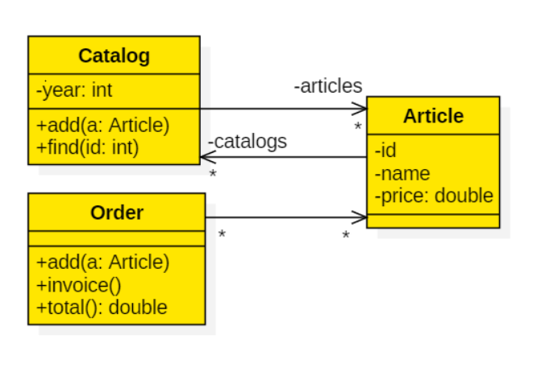

# Opdracht: Article, Order, Catalog

Implementeer het volgende domeinmodel in JPA:

Belangrijk:

* De relatie tussen `Catalog` en `Article` is bidirectioneel.
* Gebruik `CrudRepositories` waar mogelijk.
* Elke entiteit moet een `id` bevatten, maar het `id` van `Article` heeft een functionele betekenis en kan daarom niet automatisch gegenereerd worden.
* Dit is een functioneel model, geen implementatiemodel.  Je bent vrij om methodes naar eigen inzicht in andere klasses te plaatsen.
* Test het aanmaken van entiteiten en de relaties ertussen door `SpringRunner` en `@DataJpaTest` te gebruiken. 
* Je kunt initiële data in een `data.sql`-bestand in src/main/resources zetten, zodat Spring deze kan uitlezen. 
